<!-- Generated by GitHub Profile Agent Console. Edit profile.config.json, then run npm run generate. -->

  <picture>
    <source media="(max-width: 760px) and (prefers-color-scheme: dark)" srcset="./assets/hero/agent-console-46d69609-mobile-dark.svg">
    <source media="(max-width: 760px)" srcset="./assets/hero/agent-console-46d69609-mobile-light.svg">
    <source media="(prefers-color-scheme: dark)" srcset="./assets/hero/agent-console-46d69609-dark.svg">
    <source media="(prefers-color-scheme: light)" srcset="./assets/hero/agent-console-46d69609-light.svg">
    
  </picture>

  

## About Me

I'm a Computer Science student passionate about Artificial Intelligence, Backend Development, and building impactful software.

I enjoy turning ideas into real-world applications while continuously learning modern technologies, solving challenging problems, and contributing to open-source projects.

## Current Focus

| Area | What I am exploring |
| --- | --- |
| **Artificial Intelligence** | Building AI-powered applications using LLMs, AI Agents, and modern AI frameworks. |
| **Full Stack Development** | Developing scalable web applications with Next.js, TypeScript, and modern backend technologies. |
| **Backend Engineering** | Designing APIs, databases, authentication systems, and cloud-ready architectures. |

## Featured Work

| Project | Focus | Why it matters |
| --- | --- | --- |
| [**FinanceAI**](https://finance-ai-beta-orcin.vercel.app/) | AI Personal Finance Platform | Empowers users to manage their finances confidently with AI-powered insights and intelligent budgeting. |
| [**3Dex Studio**](https://3dex.studio) | Business Website | Creates a professional online presence that helps businesses showcase their services and convert visitors into clients. |

## Research Direction

I'm interested in building intelligent software that combines large language models, scalable backend systems, and modern web technologies to solve practical real-world problems.

## Tech Stack

`TypeScript` · `JavaScript` · `Python` · `C++` · `Next.js` · `React` · `Tailwind CSS` · `Node.js` · `Prisma` · `Supabase` · `PostgreSQL` · `Google Gemini API` · `Git` · `GitHub`

## Recent Activity

<!-- AUTO:ACTIVITY:START -->
_Recent public activity will appear here after the workflow runs._
<!-- AUTO:ACTIVITY:END -->

---

  Always learning, always building, and always shipping.

